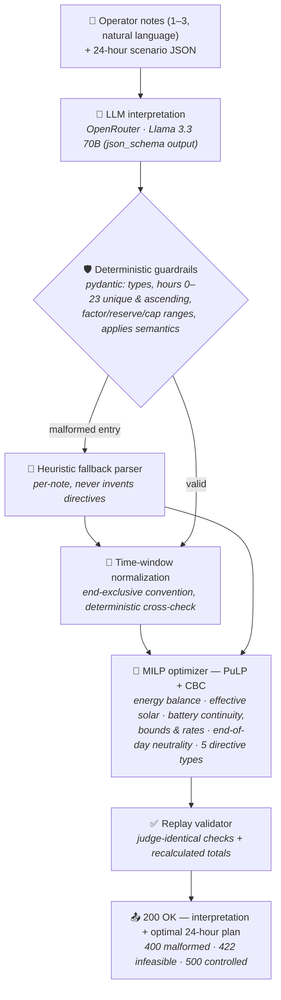

<h1 align="center">⚡ GridWise</h1>

<p align="center">
  <strong>LLM-Assisted Campus Energy Optimization</strong><br>
  <sub>BUP CSE FEST 2026 · Hackathon · Online Preliminary Round</sub>
</p>

<p align="center">
  
  
  
  
  
</p>

<p align="center">
  🌐 <a href="http://20.42.57.63/"><strong>Live dashboard</strong></a>
  ·
  <a href="http://20.42.57.63/docs"><strong>API docs</strong></a>
  ·
  🧪 <code>POST /optimize-energy<a href="http://20.42.57.63/optimize-energy" ></code> · <code>GET /health<a href="http://20.42.57.63/health" ></code>
</p>

---

## 🎯 What it does

One HTTP service that turns **plain-language operator notes** into an **optimal 24-hour
campus energy schedule**:

> *"Solar output will drop to about 20% from 1 PM to 3 PM."*
> *"The cafeteria menu changes tomorrow."*

1. 🔍 An **LLM** reads the notes and proposes structured directives (and flags distractors as `no_op`)
2. 🛡️ **Deterministic guardrails** validate every proposal — malformed output is never invented around
3. 📐 An **MILP optimizer** minimizes grid electricity cost under battery & energy physics
4. ✅ A **replay validator** re-checks the plan exactly like the judge before responding

**Pipeline:** `POST /optimize-energy` → *(interpretation + machine-checkable schedule)* in one JSON response.

## 🏗️ Architecture



**Design guarantees**

| Guarantee | How |
| --- | --- |
| 🧠 LLM is mandatory in the interpretation path | The model's structured output produces the optimizer constraints |
| 🛡️ Invalid LLM output can't corrupt the schedule | Strict schemas; per-note fallback; unsupported types never invented |
| 🕐 Window convention is exact | LLM hours are cross-checked by an independent parser (end-exclusive: *1 PM → 3 PM* = `[13, 14]`) |
| 🧮 Global optimality | One 24-hour MILP (not greedy) → battery continuity & end-of-day neutrality hold by construction |
| 🔄 Never fails a case | Progressive relaxation ladder returns a *valid* plan even under contradictory interpretations |
| 🔁 Fast on retries | Identical requests are served from an in-process cache (~ms) |

## 🚀 Local quickstart

```bash
# 1️⃣ Clone & enter
git clone https://github.com/mdhabibullahmahmudncs13/BUP-Hackathon-Preliminary-Round.git
cd BUP-Hackathon-Preliminary-Round

# 2️⃣ Install (Python 3.12+)
python -m venv .venv && source .venv/bin/activate
pip install .

# 3️⃣ Configure (optional — see "No API key?" below)
cp .env.example .env          # set OPENROUTER_API_KEY=sk-or-v1-...

# 4️⃣ Run
uvicorn app.main:app --host 0.0.0.0 --port 8000

# 5️⃣ Verify
curl http://localhost:8000/health                     # -> {"status":"ok"}

# 6️⃣ Replay the organizer's public sample pack
python scripts/validate_samples.py http://localhost:8000
# -> 10/10 cases passed, costs equal to the reference optimum
```

> 💡 **No API key?** The service still runs end-to-end using the deterministic
> heuristic interpreter (clearly flagged in response `explanation` fields) —
> the optimizer and full API contract work without any provider credentials.

<details>
<summary><b>🐳 Docker instead</b></summary>

```bash
docker build -t gridwise-optimizer .
docker run --rm -p 8000:8000 -e OPENROUTER_API_KEY=sk-or-v1-... gridwise-optimizer
```

Registry fallback image (GHCR, exact SHA tag built by CI):

```bash
docker pull ghcr.io/mdhabibullahmahmudncs13/gridwise-optimizer:31bda0d925651e7287858f94a131d127e81c645e
```

The package is currently **private** — pull it after being added as a package
collaborator, or after `docker login ghcr.io` with a `read:packages` token.
Building locally from the repo produces an identical image (deps pinned in
`requirements.txt`, no baked-in secrets, non-root user, binds `0.0.0.0:8000`).

</details>

## 🔑 Environment variables

| Name | Required | Default | Purpose |
| --- | :---: | --- | --- |
| `OPENROUTER_API_KEY` | for the LLM path | — | OpenRouter key; without it the deterministic fallback serves every request |
| `OPENROUTER_MODEL` | — | `meta-llama/llama-3.3-70b-instruct` | Primary interpretation model |
| `OPENROUTER_FALLBACK_MODEL` | — | `meta-llama/llama-3.1-70b-instruct` | Same-provider fallback (rate limits / outages) |

🔒 Secrets load from `.env` (gitignored). No keys are committed, logged, or echoed in
responses; stack traces never reach clients.

## 📡 API example

```bash
curl -X POST http://localhost:8000/optimize-energy \
  -H "Content-Type: application/json" \
  -d '{
    "scenario_id": "GRID-101",
    "operator_notes": [
      "Solar output will drop to about 20% from 1 PM to 3 PM.",
      "The cafeteria menu changes tomorrow."
    ],
    "hours": [
      {"hour": 0, "demand_kwh": 180, "solar_kwh": 0, "tariff_bdt_per_kwh": 7},
      {"hour": 23, "demand_kwh": 200, "solar_kwh": 0, "tariff_bdt_per_kwh": 9}
    ],
    "battery": {
      "capacity_kwh": 500, "initial_energy_kwh": 200, "minimum_energy_kwh": 50,
      "max_charge_kwh_per_hour": 100, "max_discharge_kwh_per_hour": 100
    }
  }'
```

<details>
<summary><b>📤 Example response (abridged)</b></summary>

```json
{
  "scenario_id": "GRID-101",
  "directive_interpretation": [
    {
      "note_index": 0,
      "applies": true,
      "directive_type": "solar_reduction",
      "structured_adjustment": { "hours": [13, 14], "factor": 0.2 },
      "explanation": "Solar availability is reduced during panel cleaning."
    },
    {
      "note_index": 1,
      "applies": false,
      "directive_type": "no_op",
      "structured_adjustment": null,
      "explanation": "This note does not affect today's energy schedule."
    }
  ],
  "hourly_plan": [
    {
      "hour": 0, "grid_kwh": 180.0, "solar_used_kwh": 0.0,
      "battery_action": "idle", "battery_kwh": 0.0,
      "battery_energy_after_kwh": 200.0
    }
  ],
  "total_grid_kwh": 0.0,
  "total_cost_bdt": 0.0,
  "peak_grid_kwh": 0.0,
  "plan_summary": "Applied 1 operator directive(s) (solar_reduction); ..."
}
```

</details>

**Status codes:** `200` success · `400` malformed/invalid JSON · `422` valid JSON but
infeasible optimization · `500` controlled internal error. Malformed LLM output never
surfaces as an error — it degrades to the fallback interpreter per note.

## 🧪 Testing

```bash
pip install .[dev]
pytest                                          # 80+ tests: guardrails · MILP · validator · API · sample pack
RUN_LIVE_LLM=1 pytest tests/test_live_llm.py    # optional: real OpenRouter round-trip
python scripts/validate_samples.py <base_url>   # public pack against any running instance
```

`tests/test_samples.py` replays all 10 organizer public cases judge-style:
interpretation ground truth, directive application, energy balance, battery rules,
neutrality, and recalculated totals.

### 📊 Public sample pack — results (deployed service)

| Case | Scenario | Interpretation | Cost (BDT) | vs reference |
| --- | --- | :---: | ---: | :---: |
| SAMPLE-01 | Solar cleaning + distractor | ✅ | 38,365 | **exact** |
| SAMPLE-02 | Battery charging maintenance | ✅ | 42,885 | **exact** |
| SAMPLE-03 | Emergency reserve (% of capacity) | ✅ | 35,480 | **exact** |
| SAMPLE-04 | No-discharge protection | ✅ | 40,495 | **exact** |
| SAMPLE-05 | Feeder grid cap | ✅ | 33,950 | **exact** |
| SAMPLE-06 | Reduction + no-charge + distractor | ✅ | 34,090 | **exact** |
| SAMPLE-07 | Reserve + transformer cap | ✅ | 38,550 | **exact** |
| SAMPLE-08 | Charge/discharge outages | ✅ | 37,665 | **exact** |
| SAMPLE-09 | Reduction wording normalization | ✅ | 34,873 | **exact** |
| SAMPLE-10 | Multi-constraint evening | ✅ | 41,620 | **exact** |

**10/10 interpretations correct · 10/10 costs equal to the organizer's optimal reference.**

## 🌍 Deployment

**Submitted endpoint → `http://buphackathonpreliminary.mdhabibullahmahmud.work`**

```
Azure VM ── nginx :80 ──▶ uvicorn (systemd, Restart=always, 2 workers)
   ├── GET  /                 live dashboard
   ├── GET  /health           readiness probe
   └── POST /optimize-energy  judging endpoint (no auth anywhere)
```

- ⏱️ `/health` ready in seconds (limit: 60s) · `p95` ≈ 5–10 s (limit: 30s)
- 🧮 MILP solves in milliseconds — latency is LLM round-trip, bounded by a 12 s
  per-attempt provider timeout with deterministic fallback
- 📄 Any platform works: Render, Railway, Fly.io, a plain VPS, or the Docker image

## 🧰 Tech stack & credits

| Layer | Tool |
| --- | --- |
| HTTP API | [FastAPI](https://fastapi.tiangolo.com/) + [Uvicorn](https://www.uvicorn.org/) |
| Schemas & guardrails | [Pydantic v2](https://docs.pydantic.dev/) |
| Optimization | [PuLP](https://github.com/coin-or/pulp) + CBC solver |
| LLM provider | [OpenRouter](https://openrouter.ai/) · Meta Llama 3.3 / 3.1 70B |
| HTTP client | [httpx](https://www.python-httpx.org/) |

> AI coding assistance was used for implementation. The architecture
> (LLM → guardrails → MILP → replay validation) and all logic are the team's own work.

## ⚠️ Known limitations

- The heuristic fallback covers common phrasings of the five directive types; heavily
  paraphrased notes may degrade to `no_op` when the LLM is unavailable.
- The infeasibility-relaxation ladder prefers returning a *valid* plan over failing when
  interpreted directives are contradictory (organizer scenarios are guaranteed feasible —
  this only guards against our own interpretation errors).
- Battery round-trip efficiency is 1.0 (no loss model is defined in the problem statement).

---

<p align="center">
  <sub>Built for the BUP CSE FEST 2026 Online Preliminary · ⚡ GridWise team</sub>
</p>
